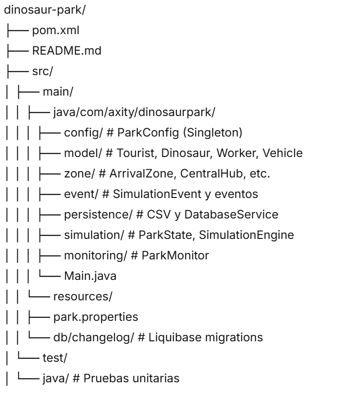
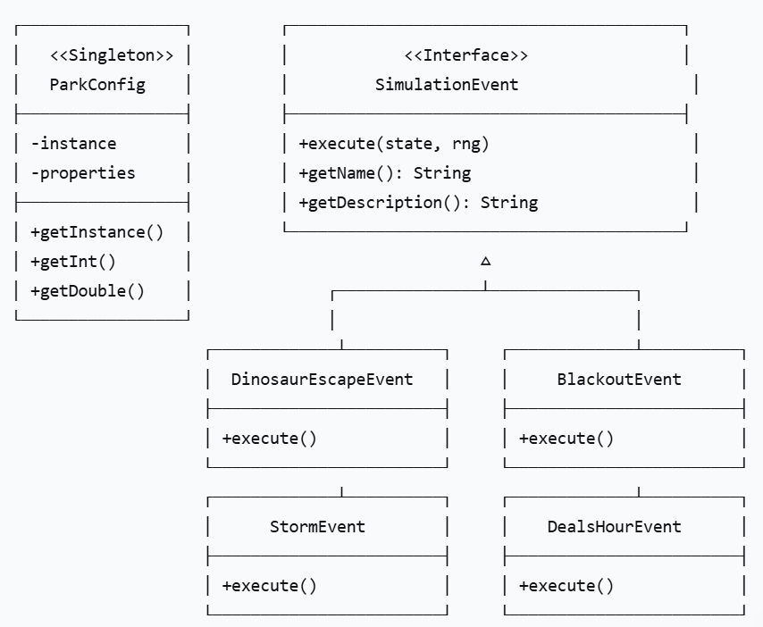
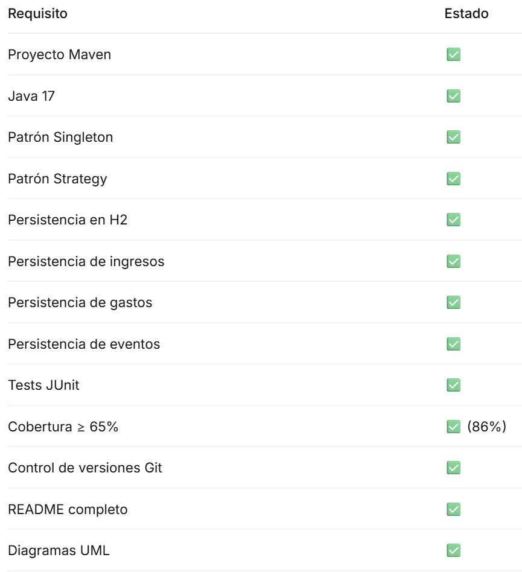

# 🦕 Parque Turístico de Dinosaurios

## 📋 Descripción del Proyecto

Simulación de un parque temático de dinosaurios desarrollada en Java 17 como parte del laboratorio del Bloque 4. El sistema permite gestionar y simular el comportamiento de:

- **Turistas**: llegan, compran boletos, visitan zonas, gastan dinero
- **Dinosaurios**: carnívoros y herbívoros con diferentes niveles de peligro
- **Trabajadores**: guardias que recapturan dinosaurios y técnicos que reparan equipos
- **Vehículos de mantenimiento**: se rompen y se reparan automáticamente
- **Eventos aleatorios**: escapes, apagones, tormentas, ofertas, fallas de vehículos
- **Zonas del parque**: arribo, recinto central, baños, planta de energía, encierros

---

## 🛠️ Herramientas Utilizadas

| Herramienta   | Versión           | Propósito |
|-------------  |---------          |-----------|
| Java JDK      | 17                | Lenguaje de programación |
| Maven         | 3.8+              | Gestión de dependencias y construcción |
| JUnit 5       | 5.10.2            | Pruebas unitarias |
| Mockito       | 5.11.0            | Mocks para pruebas |
| H2 Database   | 2.2.224           | Base de datos embebida |
| Liquibase     | 4.27.0            | Migraciones de base de datos |
| JaCoCo        | 0.8.11            | Cobertura de código |
| Git           | -                 | Control de versiones |

---

## 📦 Estructura del Proyecto

## 🚀 Instrucciones de Configuración

### 1. Requisitos previos

- Java JDK 17 instalado
- Maven 3.8+ instalado
- Git (opcional, para clonar el repositorio)

### 2. Clonar el repositorio

git clone https://github.com/Jadd0191/practicaBloque4.git
cd practicaBloque4

### 3. Configurar archivo park.properties
- El archivo ya incluye todas las configuraciones necesarias. Puedes modificarlo según tus necesidades:

# Simulación
simulation.totalSteps=100
simulation.arrivalBatchSize=5

# Turistas
tourists=50

# Dinosaurios
dinosaurs.carnivores=5
dinosaurs.herbivores=15

# Trabajadores
workers.guards=3
workers.technicians=2
workers.dailySalary=150.0

# Precios
arrival.ticketPrice=25.0
hub.souvenirPrice=15.0
bathroom.spaPrice=20.0

# Energía
powerplant.initialEnergy=100.0
powerplant.consumptionPerStep=1.5
powerplant.failureProbability=0.05

# Vehículos (Nivel Intermedio)
vehicles.count=4
vehicles.repairSteps=5

# Probabilidades de eventos
event.escape.probability=0.05
event.blackout.probability=0.03
event.storm.probability=0.04
event.deals.probability=0.08
event.vehicleFailure.probability=0.06

# Monitoreo
monitoring.intervalSteps=10

# Base de datos
db.path=./data/parkdb

▶️ Forma de Ejecución
# Compilar el proyecto
mvn clean compile

# Ejecutar la simulación
mvn exec:java

# Ejecutar las pruebas unitarias
mvn clean test

# Ver reporte de cobertura
mvn jacoco:report

Luego abre target/site/jacoco/index.html en tu navegador.

# Verificar datos en H2
java -cp "target/classes;%USERPROFILE%\.m2\repository\com\h2database\h2\2.2.224\h2-2.2.224.jar" org.h2.tools.Shell -url jdbc:h2:./data/parkdb -user sa -sql "SELECT COUNT(*) FROM REVENUES;"

# 📊 Explicación General del Sistema
# Flujo de la Simulación
**Inicialización**: Se crean turistas, dinosaurios, trabajadores y vehículos según la configuración.
**Llegada de turistas**: Los turistas llegan en lotes, compran boletos y entran al parque.
**Movimiento**: Los turistas visitan zonas (hub, baños, encierros) y gastan dinero.
**Ticks**: Las zonas avanzan el tiempo (baños, planta de energía, vehículos).
**Eventos**: Cada step se evalúa la probabilidad de cada evento y se ejecutan.
**Trabajadores**: Guardias recapturan dinosaurios; técnicos reparan la planta (requieren vehículo).
**Monitoreo**: Cada N steps se muestra un resumen del estado del parque.
**Persistencia**: Todos los ingresos, gastos y eventos se guardan en H2.

# Eventos del Sistema
**Evento                Probabilidad        Efecto**
Escape de dinosaurio	5%	                Un dinosaurio escapa y puede atacar turistas
Apagón masivo	        3%	                Planta de energía falla, gasto $2000
Tormenta torrencial	    4%	                Evacuación de turistas, gasto $500
Hora de ofertas	        8%	                30% de descuento en boletos y souvenirs
Falla de vehículo	    6%	                Un vehículo se rompe (se repara solo con el tiempo)

# Monitor (5 métricas)

╔════════════════════════════════════════════════════════════════╗
║                    MONITOR DEL PARQUE                          ║
╠════════════════════════════════════════════════════════════════╣
║ Step: 10                                                       ║
║ 1. Turistas activos: 30                                        ║
║ 2. Dinosaurios en encierro: 18                                 ║
║ 3. Energía disponible: 85.5%                                   ║
║ 4. Eventos activos: HORA_DE_OFERTAS                            ║
║ 5. Vehículos no disponibles: 1                                 ║
╚════════════════════════════════════════════════════════════════╝

# 🎨 Patrones de Diseño Utilizados
**1. Singleton - ParkConfig**
¿Dónde se aplica? Clase ParkConfig
¿Por qué? Garantiza que la configuración del parque se cargue una sola vez y sea accesible globalmente.

public final class ParkConfig {
    private static ParkConfig instance;
    private ParkConfig() { }
    public static ParkConfig getInstance() { ... }
}
**2. Strategy - SimulationEvent**
¿Dónde se aplica? Interfaz SimulationEvent y sus implementaciones
¿Por qué? Permite intercambiar diferentes comportamientos (eventos) sin modificar el motor de simulación.

public interface SimulationEvent {
    void execute(ParkState state, Random rng);
}

// Implementaciones
public class DinosaurEscapeEvent implements SimulationEvent { ... }
public class BlackoutEvent implements SimulationEvent { ... }
public class StormEvent implements SimulationEvent { ... }

# Diagrama de Clases

# 📈 Resultados de Pruebas
**Cobertura de código**

Total: 86% (supera requisitos: básico 45%, intermedio 65%)
- simulation: 97%
- event: 89%
- zone: 85%
- model: 69%
- config: 66%
- persistence: 96%
- monitoring: 96%
# Tests ejecutados

Tests run: 97, Failures: 0, Errors: 0, Skipped: 0

# 📁 Salidas Generadas
**Base de datos H2**
Ubicación: ./data/parkdb.mv.db
Tablas: revenues, expenses, events

# Archivos CSV (modo básico)
output/revenues.csv - Ingresos generados
output/expenses.csv - Gastos operativos
output/events.csv - Eventos ocurridos

# ✅ Checklist de Requisitos Cumplidos

